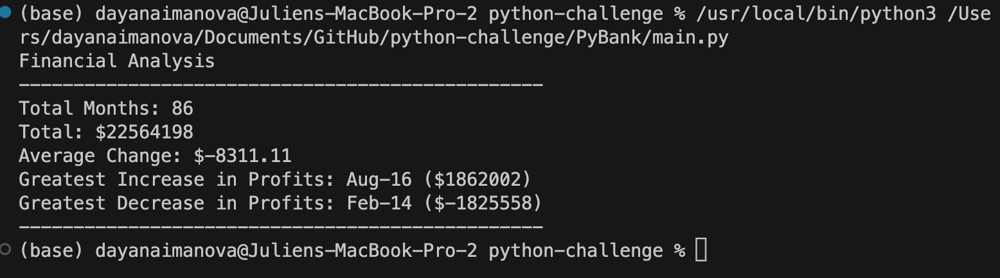
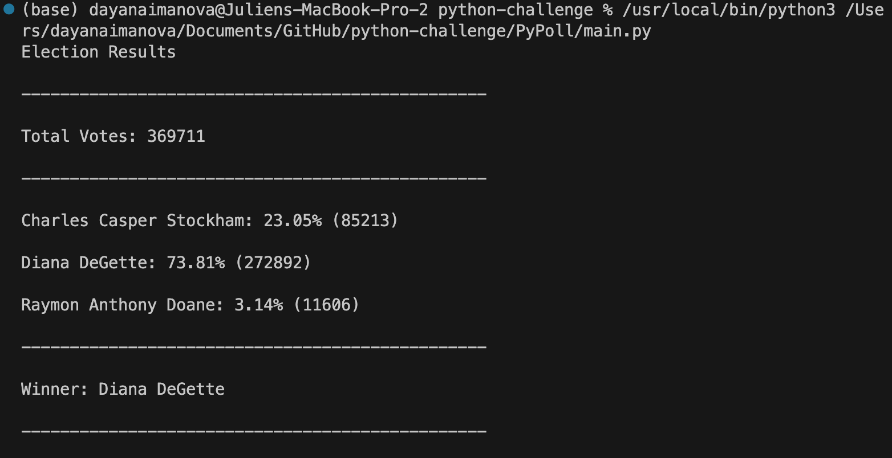

# Module 3 Challenge

## Table of context

- [About](#about)
- [Getting Started](#getting_started)
- [Installing](#installing)
- [Result Screenshots](#result_screenshots)
- [Acknowledgements](#Acknowledgements)

## About

It's time to put away the Excel sheet and enter the world of programming with Python. In this assignment, you'll use the concepts you've learned to complete two Python challenges, PyBank and PyPoll. Both tasks present a real-world situation where your newly developed Python scripting skills come in handy.

### PyBank Instructions
In this Challenge, you are tasked with creating a Python script to analyze the financial records of your company. You will be given a financial dataset called budget_data.csv. The dataset is composed of two columns: "Date" and "Profit/Losses".
- Your task is to create a Python script that analyzes the records to calculate each of the following values:
- The total number of months included in the dataset
- The net total amount of "Profit/Losses" over the entire period
- The changes in "Profit/Losses" over the entire period, and then the average of those changes
- The greatest increase in profits (date and amount) over the entire period
- The greatest decrease in profits (date and amount) over the entire period

### PyPoll Instructions
- The total number of votes cast
- A complete list of candidates who received votes
- The percentage of votes each candidate won
- The total number of votes each candidate won
- The winner of the election based on popular vote

## Getting started

You will find **2 Folders**, one is **PyBank**,and the other is **PyPoll**. In each of those files there is a resource file with the **.csv** file, a **.py** script file and a **.txt** file created through running the script.

## Installing

1) To get started, choose one of the folders (PyBank or PyPoll)
2) You can delete the .txt file to ensure that the script is creating a new .txt file.
3) Open the .py file and run the code.
4) It should print the results in the terminal, as well as, create a .txt file in the folder that you've opened.
5) Repeat steps for the other folder. 

## Result Screenshots

*Caption: The terminal result for PyBank activity.*

*Caption: The terminal result for PyPoll activity.*

## Acknowledgements

- [W3Schools](https://www.w3schools.com/python/)
